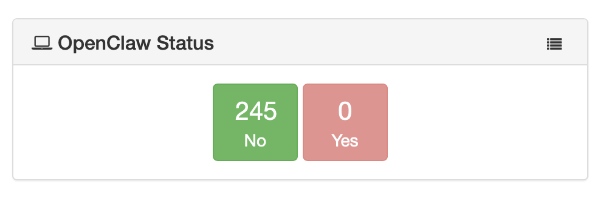

# openclaw_module
An OpenClaw detection module for munkireport based on https://github.com/knostic/openclaw-detect

> v. 1.0.0
> March 11, 2026 
> Alex Narvey / Precursor.ca
>
> 

Detects and reports on OpenClaw instances.

The following information is stored in the table:

* Summary - Whether OpenClaw is present
* Platform - Always Darwin for Macs
* App - 
* CLI - 
* CLI Version - 
* State Dir - 
* Config - 
* Gateway Services -
* Gateway Port -
* Docker Container -
* Docker Image -

## Updates

* March 11, 2026 Version 1.0.0  Made a module based on the detector from https://github.com/knostic/openclaw-detect

## Contributors
* Alex Narvey

—
Alex Narvey
